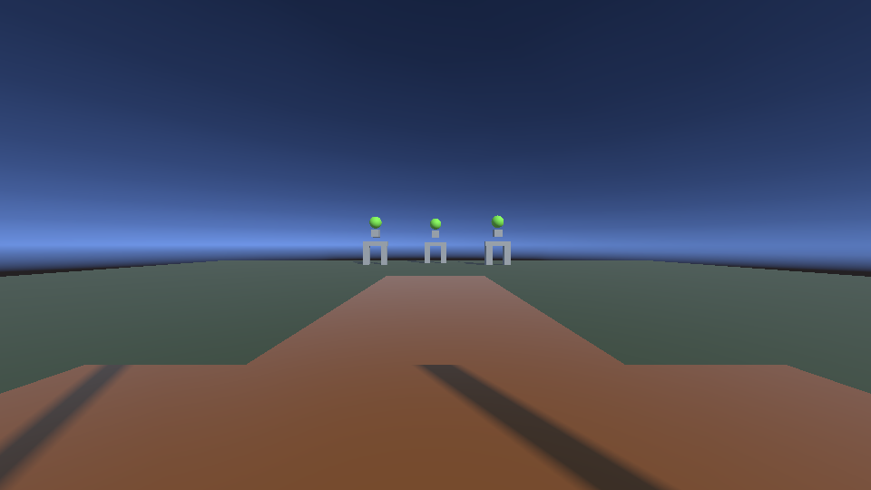
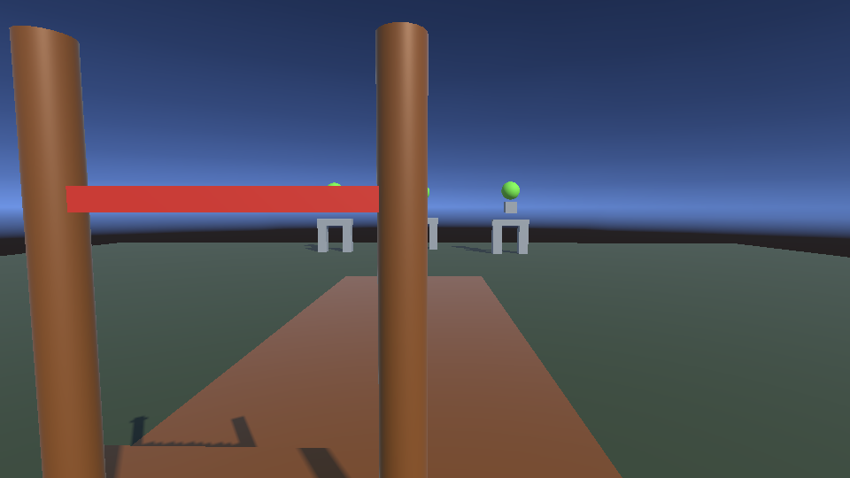

# Unity MCP CLI

`unity-mcp-cli` is a CLI-first Unity assistant for projects that use the AnkleBreaker Unity MCP plugin.

It talks directly to the Unity plugin's local HTTP bridge instead of relying on a full MCP tool-registration flow every turn. The result is a faster, easier-to-debug shell surface for Codex and other command-driven agents.

<p align="center">
  
  
</p>

<p align="center"><sub>Example Game View and Scene View captures saved by <code>debug capture --kind both</code>. These images come from disposable validation scenes used to test the CLI.</sub></p>

## Why This Exists

- Lower overhead than exposing everything through a giant MCP surface
- Better debugging for real Unity problems
- A shell-friendly workflow for Codex, scripts, and CI
- Direct access to the same Unity-side backend the upstream ecosystem already uses

## What It Does

- discovers running Unity editors
- inspects project, scene, hierarchy, console, compilation, queue, and editor state
- creates and edits scripts, scene objects, components, references, and prefabs
- captures Game View and Scene View screenshots
- explains likely Unity problems with `debug doctor`
- shows recent CLI activity with `debug trace`
- reads the real Unity `Editor.log`
- exposes an optional thin MCP adapter when a client still needs MCP transport

## What This Repo Is

This repo is the CLI/client layer.

It is not a clean-room replacement for the Unity backend. The Unity-side plugin still does the real editor work. This project focuses on making that backend easier to drive, observe, and automate from the command line.

If you are using this repo with Codex or another coding agent, read [AGENTS.md](AGENTS.md) first. It defines the intended CLI-first workflow, debugging loop, and verification expectations.

## What You Need

- Python `3.11+`
- `click>=8.1`
- a Unity project with the AnkleBreaker Unity MCP plugin installed
- the Unity Editor running

If plugin setup is the unclear part, start with [PLUGIN_SETUP.md](PLUGIN_SETUP.md).

## Install

```powershell
python -m pip install -r requirements.txt
python -m pip install -e .
```

Or just:

```powershell
python -m pip install -e .
```

Main command:

```powershell
cli-anything-unity-mcp
```

Optional thin MCP adapter:

```powershell
cli-anything-unity-mcp-mcp --default-port <port> --port-range-start <port> --port-range-end <port>
```

## Quick Start

1. Open your Unity project.
2. Make sure the AnkleBreaker Unity plugin is installed in that project.
3. Wait for Unity to log a bridge port like `[AB-UMCP] Server started on port 7892`.
4. From this repo:

```powershell
cli-anything-unity-mcp instances
cli-anything-unity-mcp select <port>
cli-anything-unity-mcp --json workflow inspect --port <port>
cli-anything-unity-mcp --json debug doctor --port <port>
cli-anything-unity-mcp --json debug capture --kind both --port <port>
```

## Using This With Codex

The intended pattern is:

1. use the CLI as the main Unity control surface
2. inspect and debug before making changes
3. verify with trace, editor log, and captures

Start here:

```powershell
cli-anything-unity-mcp --json workflow inspect --port <port>
cli-anything-unity-mcp --json debug doctor --port <port>
cli-anything-unity-mcp --json debug trace --tail 20
cli-anything-unity-mcp --json debug capture --kind both --port <port>
```

Normal commands now emit visible Unity-side `[CLI-TRACE]` breadcrumbs, so you can watch agent activity in the Unity Console or Editor log:

```powershell
cli-anything-unity-mcp debug editor-log --contains "CLI-TRACE" --follow
```

For multi-step workflows, those breadcrumbs now include substeps like:

- `locke-debug: Checking project info`
- `locke-debug: Checking editor state`
- `locke-debug: Inspecting scene hierarchy (depth 3, max 12 nodes)`
- `locke-debug: Listing assets in Assets/Scripts`

## Best Commands To Know

### General

```powershell
cli-anything-unity-mcp instances
cli-anything-unity-mcp select <port>
cli-anything-unity-mcp --json status --port <port>
cli-anything-unity-mcp --json workflow inspect --port <port>
```

### Debugging

```powershell
cli-anything-unity-mcp --json debug doctor --recent-commands 8 --port <port>
cli-anything-unity-mcp --json debug bridge --port <port>
cli-anything-unity-mcp --json debug trace --tail 20
cli-anything-unity-mcp --json debug snapshot --console-count 100 --include-hierarchy --port <port>
cli-anything-unity-mcp --json debug capture --kind both --port <port>
cli-anything-unity-mcp --json debug editor-log --tail 120 --ab-umcp-only
```

### Tool Surface

```powershell
cli-anything-unity-mcp --json tools --search scene
cli-anything-unity-mcp --json tool-info unity_scene_stats
cli-anything-unity-mcp --json tool unity_scene_stats --port <port>
cli-anything-unity-mcp --json tool-coverage --summary
```

## Coverage Snapshot

Current checked-in matrix:

- `328` upstream catalog tools
- `31` live-tested
- `31` covered
- `260` deferred
- `6` unsupported

Important nuance:

- `unsupported` currently means Unity Hub-only functionality
- `deferred` means known work that still needs wrapper depth, live audits, or package-specific validation

Use:

```powershell
cli-anything-unity-mcp --json tool-coverage --summary
cli-anything-unity-mcp --json tool-coverage --status unsupported
cli-anything-unity-mcp --json tool-coverage --status deferred --category terrain
```

## Product Direction

The main goal is to make this the best Unity CLI assistant surface:

- stronger debugging than raw MCP transport
- better recovery around play mode and bridge rebinding
- higher tool parity with the upstream ecosystem
- room for custom tools and eventually deeper backend independence

Validation should happen through CLI diagnostics, tool audits, and temporary probes. The shipped product surface is the CLI layer itself.

## Repo Boundaries

- You do **not** need `unity-mcp-server` to use this CLI.
- You do **not** need your own plugin fork just to use this CLI.
- You **do** need the Unity plugin installed in the Unity project you want to control.

This repo stays focused on the CLI layer. If you need more beginner setup help, use [START_HERE.md](START_HERE.md) and [PLUGIN_SETUP.md](PLUGIN_SETUP.md).

## Docs

- [START_HERE.md](START_HERE.md): beginner-friendly walkthrough
- [PLUGIN_SETUP.md](PLUGIN_SETUP.md): plugin install steps
- [TEST.md](TEST.md): validation commands and test flows
- [TODO.md](TODO.md): roadmap and coverage work
- [ATTRIBUTION.md](ATTRIBUTION.md): upstream attribution and boundaries
- [CONTRIBUTING.md](CONTRIBUTING.md): contributor workflow

## Attribution

This project is a separate CLI/client layer built around the AnkleBreaker Unity MCP ecosystem. It still depends on the Unity-side plugin at runtime.

See [ATTRIBUTION.md](ATTRIBUTION.md) for the exact repo boundary and upstream credit notes.

## License

This repository is MIT licensed. See [LICENSE](LICENSE).
